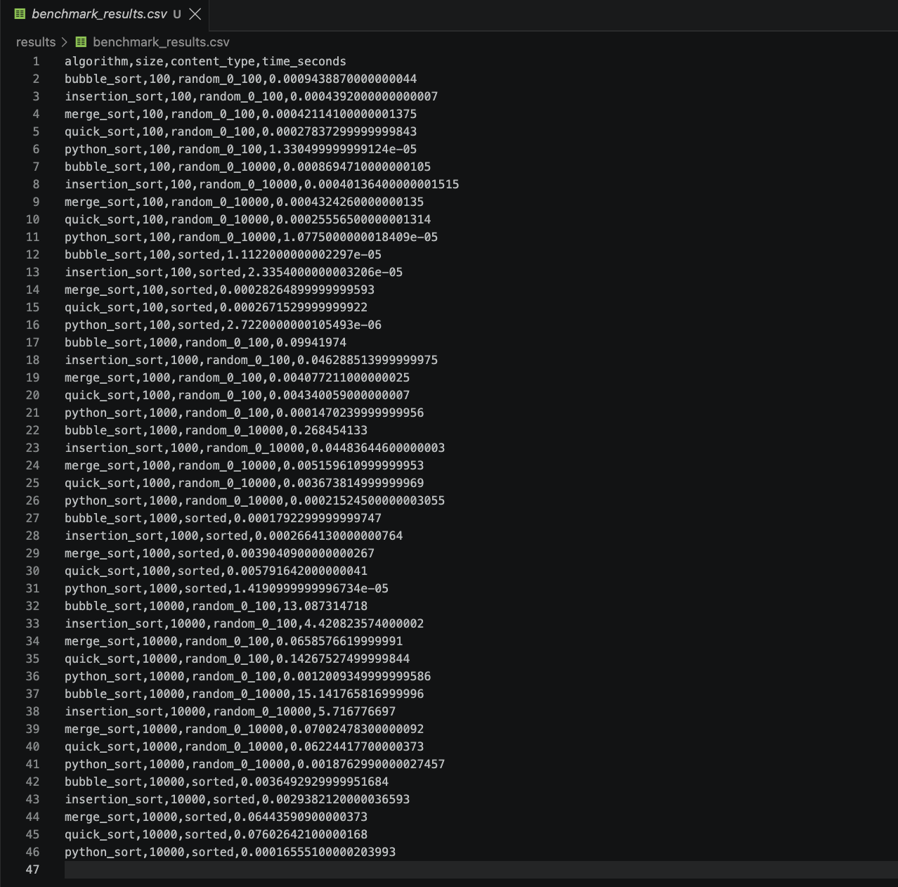
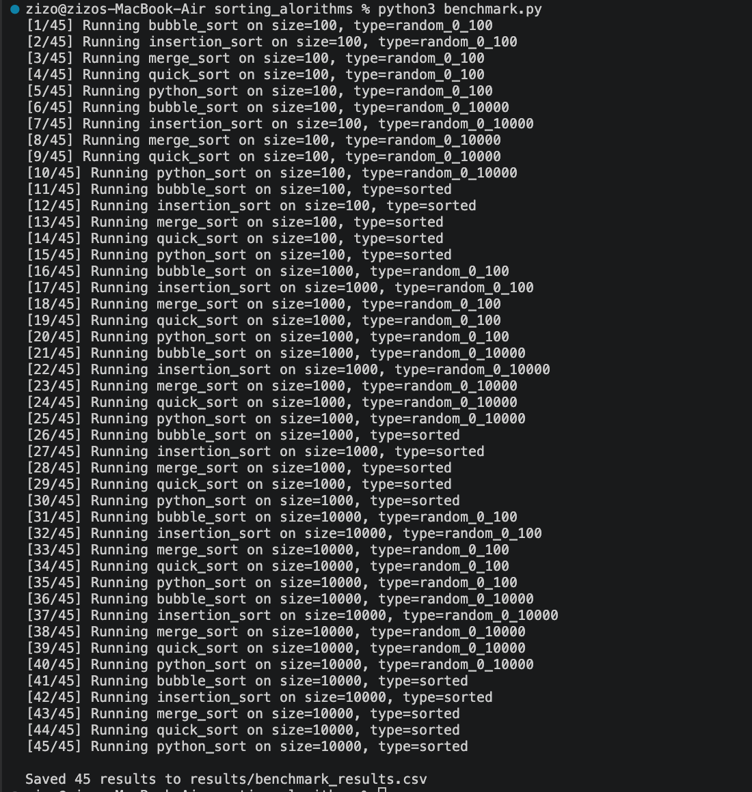
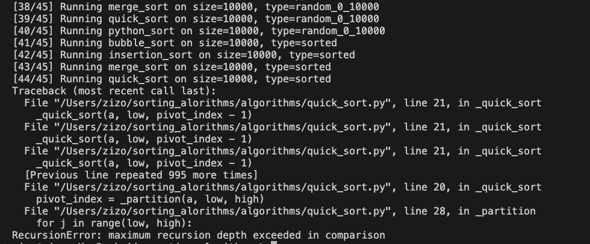

# Sorting Algorithms Benchmark
A Python project comparing the performance of Bubble Sort, Insertion Sort, Merge Sort, Quick Sort, and Python’s built-in sorted() function. The algorithms were tested with different list sizes and input types to compare their actual runtime with their theoretical Big O complexity. AI was used to assist with the initial implementation and test structure.

## Expected output

> This was my school report used for submission translated to English:

## Common errors 

